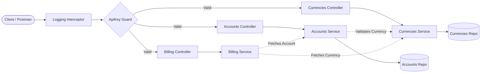

# Multi‑Product Feasibility API

### System Flow Diagram


This project contains a simple Node.js implementation of the multi‑product feasibility assessment described in the technical specification.  It exposes a RESTful API that accepts a product name and geographic coordinates, calls an upstream feasibility service to determine what technologies are viable, caches results to avoid repeated lookups, maps technologies back to the requested product and returns a structured response.

> **Note**: The assessment environment does not permit installation of external software such as Redis or NPM packages.  To satisfy the caching requirement under these constraints, the implementation uses a plain JavaScript `Map` as an in‑memory cache.  The cache key combines the requested product and location; entries expire automatically after one hour.  In a production environment this cache would be replaced with a proper Redis client and server.

## Running the service

1. Navigate into the project directory:

   ```sh
   cd feasibility-api
   ```

2. Configure environment variables:

   * **FEASIBILITY_API_KEY** – API key for the upstream Feasibility Service.  Required.
   * **FEASIBILITY_BASE_URL** – Hostname of the upstream service (e.g. `feasibility.api.comsol.co.za`).  Optional; defaults to that value if unset.
   * **REDIS_URL** – URL of a Redis server used for caching (e.g. `redis://localhost:6379`).  Alternatively, set `REDIS_HOST`, `REDIS_PORT` and optionally `REDIS_PASSWORD` instead.  If no Redis configuration is provided the service falls back to an in‑memory cache.

   Example configuration:

   ```sh
   export FEASIBILITY_API_KEY="281c4f7ec3332610969dbffb05013166"
   export FEASIBILITY_BASE_URL="feasibility.api.comsol.co.za"
   export REDIS_URL="redis://127.0.0.1:6379"
   ```

3. Start the server using Node:

   ```sh
   node server.js
   ```

   The server listens on port **3000** by default.  You can override this by setting the `PORT` environment variable, e.g. `PORT=8080 node server.js`.

3. Once running, you can exercise the API using `curl` or any HTTP client.  For example:

   ```sh
   curl -X POST http://localhost:3000/check-product-feasibility \
        -H "Content-Type: application/json" \
        -d '{"latitude":-25.874,"longitude":28.194,"requested_product":"Wireless Business"}'
   ```

   The response will resemble:

   ```json
   {
     "requested_product": "Wireless Business",
     "feasible_technologies": ["PtMP-CX", "5G"],
     "best_fit_product": "Wireless Business",
     "reason": "Selected Wireless Business because technology PtMP-CX is feasible"
   }
   ```

4. **Documentation**

   * The OpenAPI/Swagger specification is served at `/swagger.json`.  You can import this specification into any tool that understands the OpenAPI 3.0 format (e.g. Postman, Swagger UI) to explore the API interactively.

   * An interactive Swagger UI is available at `/docs`.  This page uses the publicly hosted `swagger-ui-dist` assets to render the API documentation in your browser.  When you browse to `http://localhost:3000/docs` (or the appropriate port), you'll see a full API explorer.

## Caching behaviour

Each response is cached using a combination of the requested product and the geographic coordinates for one hour.  The application first attempts to use a Redis instance configured via `REDIS_URL` (or `REDIS_HOST`/`REDIS_PORT`).  If Redis is reachable, cached entries are stored with an expiry of **3600 seconds** and retrieved directly from the cache on subsequent requests.  When a cached entry is returned the response includes a `cache_hit` property set to `true`.

If no Redis configuration is provided or the connection fails, the service falls back to using an in‑memory cache with the same TTL.  For remote Redis instances where the NPM `redis` package is unavailable, the service includes a lightweight RESP client that communicates directly with the server over TCP.  This means you can point the application at a remote Redis service without installing any additional Node dependencies.  If both Redis mechanisms fail, the local cache is used.  This fallback is intended for development/testing only; in production you should run a Redis server for resilience and scalability.

## Product mapping logic

The mapping between products and technologies is hard‑coded in `server.js` according to the specification:

* **Wireless Premium** → can be fulfilled by **PtP‑CX+** or **PtMP‑CX** (first match wins).
* **Wireless Business** → can be fulfilled by **PtMP‑CX**.
* **Wireless Lite** → can be fulfilled by **5G** or **PtMP‑CX**.

During a request, the server compares the list of technologies returned by the upstream service against the allowed technologies for the requested product.  The first match determines the best‑fit product; if none of the allowed technologies are present the `best_fit_product` field is `null` and the response explains that no technologies were feasible.
